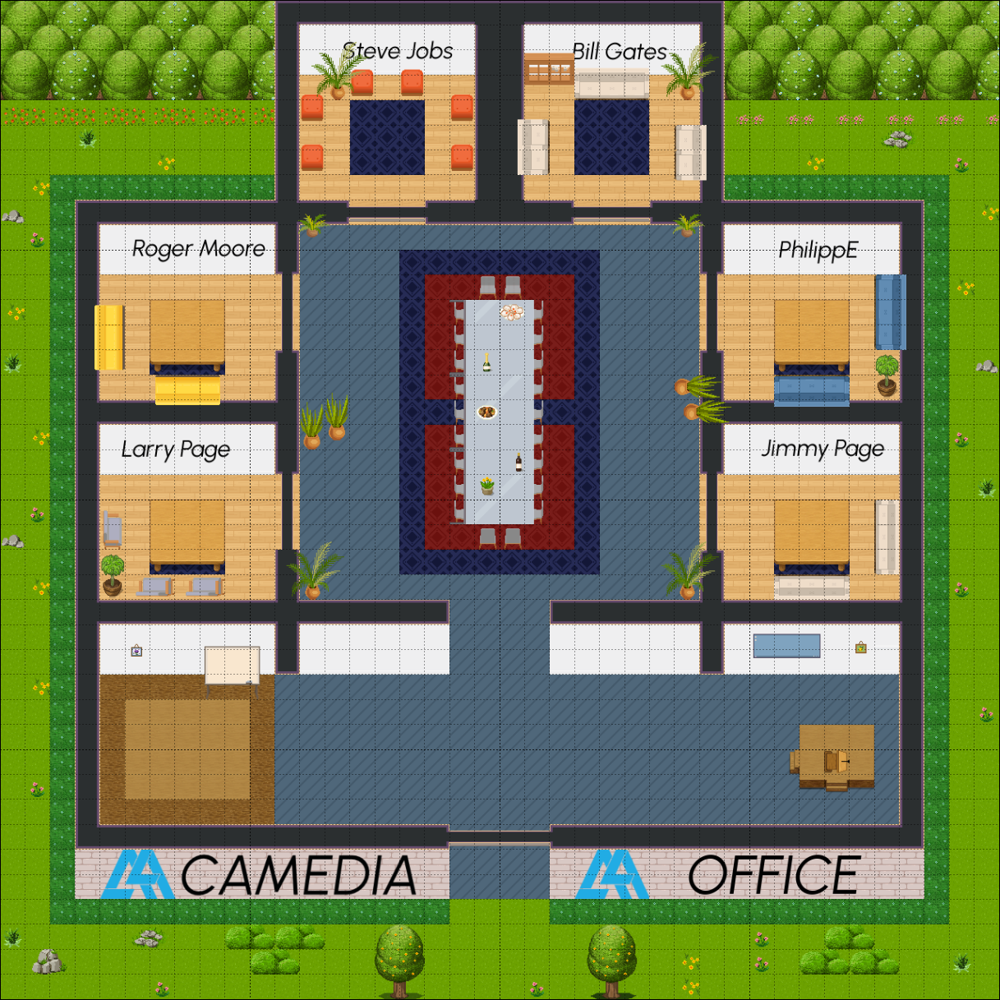

# 🗺️ WorkAdventure Map

## 🗂️ Structure

We follow this file structure:

- *`public/`*: Static files like PDFs or audio files
- *`src/`*: Script files or design source files
- *`tilesets/`*: All PNG tilesets

## 📜 Requirements

- Node.js version >= 18

## Installation and testing

## 📜 Licenses

This project contains multiple licenses as follows:

- [Code license](./LICENSE.code) *(all files except those for other licenses)*
- [Map license](./LICENSE.map) *(`office.tmj` and the map visual as well)*
- [Assets license](./LICENSE.assets) *(the files inside the `tilesets/` folder)*

> [!IMPORTANT]
> If you add third party assets in your map, do not forget to:
>
> 1. Credit the author and license of a tileset with the "tilesetCopyright" property by etiding the tileset in Tiled.
> 2. Add the tileset license text in *LICENSE.assets*.
> 3. Credit the author and license of a map with the "mapCopyright" property in the custom properties of the map.
> 4. Add the map license text in *LICENSE.map*.
